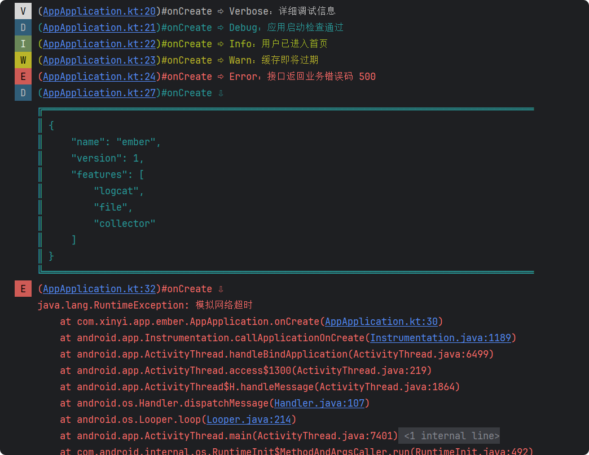
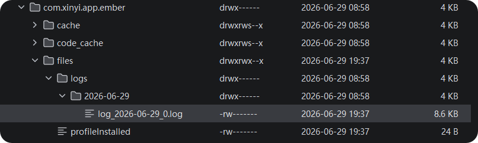
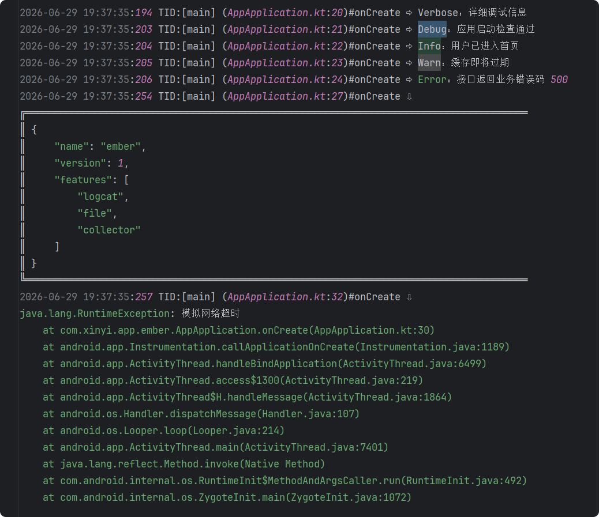

# Ember 日志框架

A modern Android logging framework with Logcat, file logging, collectors, and extensible output pipelines.

<div align="center">

  

  <br><br>

  

  <h3>木材燃烧一时，余烬铭记过往。</h3>

  <p><em>Timber burns for a moment. Embers remember the past.</em></p>

</div>


> Embers reveal what flames once were.
>
> 余烬会诉说火焰曾经的模样。

## 一、简介

**Ember** 是一个面向 Android 的日志框架，提供统一的日志入口、可插拔的输出管道，以及基于 `LogCollector` 的模块化日志管理能力。
框架内置 `Logcat` 输出、异步文件日志、`JSON` 格式化等常用能力，同时开放 `LogPrinter` 扩展接口，便于接入远程上传、自定义存储或其他输出方式。

`Ember` 会将**日志记录**与**日志输出**彻底解耦。
应用只需要描述**发生了什么**，而无需关心日志最终输出到哪里；
至于日志如何过滤、如何格式化、如何写入文件，或如何发送到其他输出目标，都交由 `Ember` 完成。

`Ember` 支持 `Verbose`、`Debug`、`Info`、`Warn`、`Error`、`Assert` 六个日志等级，
并提供总开关、最低输出等级、默认 Tag、产品类型标签与调用出处拼接等配置能力。
框架默认开启 `Logcat` 输出，同时支持异步文件输出。

日志如同程序运行后留下的余烬，静静记录着每一次燃烧，让开发者得以还原现场，理解系统曾经发生的一切。

---

## 二、SDK 适用范围

| 项目         | 要求                 |
|------------|--------------------|
| Min SDK    | 19（Android 4.4）及以上 |
| JVM Target | 1.8                |
| Kotlin     | 1.6+               |

---

## 三、集成方式

### 1. 添加仓库

在项目根 `settings.gradle` 或 `build.gradle` 中配置 JitPack：

```groovy
maven {
    url 'https://jitpack.io'
}
```

### 2. 添加依赖

Groovy：

```groovy
dependencies {
    implementation 'com.github.starseaway:ember:1.0.0'
}
```

Kotlin DSL：

```kotlin
dependencies {
    implementation("com.github.starseaway:ember:1.0.0")
}
```

### 3. 配置初始化

在 `Application.onCreate()` 中完成初始化（须在打日志之前调用）：

```kotlin
// 方式一：默认配置，内置 AndroidLogPrinter
Ember.init(LogConfig.defaultConfig())

// 方式二：按需组装配置
Ember.init(
    Ember.builder()
        .setEnabled(BuildConfig.DEBUG) // 日志输出总开关；false 时日志会在调度层直接丢弃
        .setDefaultTag("Ember") // 未传 tag 且堆栈解析失败时的兜底 tag
        .setProductTypeTag("应用不同版本类型") // 拼接在正文前，可用于区分应用不同版本的输出日志
        .setMinLevel(LogLevel.DEBUG) // 低于该等级的日志不会输出
        .setIncludeCaller(true) // 是否在日志正文前拼接调用出处
        // .clearPrinters() // 清空后须重新 addPrinter，否则无任何输出
        .addFilePrinter(File(filesDir, "logs").absolutePath)  // 可选：追加异步文件输出
        .build()
)
```

---

## 四、快速开始

### 1. 基础日志输出

完成初始化后，通过 `Ember` 静态方法打印日志：

```kotlin
// 各种日志等级输出均支持：无参 / 仅消息 / tag + 消息
Ember.v("详细调试")
Ember.d("启动完成")
Ember.i("用户已登录")
Ember.w("缓存即将过期")
Ember.e("请求失败", throwable)
Ember.wtf("不应到达此处", throwable)

// 无参调用时正文为 "Log with null Object"
Ember.d()

// JSON 日志（支持格式化展开，如果 Json 内容有误，会直接打印原内容）
Ember.json(responseBody, isFormatJson = true)

// 异常堆栈可借助 Android API 转成文本后打印
Ember.e(Log.getStackTraceString(throwable))
```

### 2. 文件日志

注册 `FileLogPrinter` 后，`Ember.d()` 等调用会异步写入本地文件，不阻塞业务线程。

```kotlin
val config = Ember.builder()
    .addFilePrinter(File(filesDir, "logs").absolutePath)
    .build()
Ember.init(config)
```

[LogConfig.Builder.addFilePrinter](library/src/main/java/com/xinyi/ember/extensions/ConfigBuilderExtension.kt) 扩展函数，默认开启过期日志自动清理（保留 3 个月、每 24 小时扫描一次）：

```kotlin
/**
 * @param logDirPath 日志根目录
 * @param maxFileSize 单文件大小上限（字节）；小于 64 KB 时回退 [FileLogger.DEFAULT_MAX_FILE_SIZE]
 * @param retainMonthCount 自动清理保留月数
 * @param clearScanIntervalMillis 自动清理扫描间隔（毫秒）
 */
LogConfig.Builder.addFilePrinter(
    logDirPath = File(filesDir, "logs").absolutePath,
    maxFileSize = FileLogger.DEFAULT_MAX_FILE_SIZE,
    retainMonthCount = FileLogPrinter.DEFAULT_RETAIN_MONTHS,
    clearScanIntervalMillis = FileLogPrinter.DEFAULT_SCAN_INTERVAL_MS
)
```

经 `Ember.init` 注册后无需手动 `shutdown` 内部线程，配置替换时会关闭被移除的实例，进程正常退出时会尽力刷完队列并关闭文件流；
系统强杀不保证最后几条成功写入本地。

单独使用 `FileLogPrinter`（未注册到 Ember）时，不再使用后须自行 `shutdown()`；也可手动 `clearLogFiles(monthCount)` 清理过期目录。

仅需同步写文件、不要后台线程时，可直接使用 `FileLogger`：

```kotlin
val fileLogger = FileLogger(
    logDirPath = File(filesDir, "logs").absolutePath,
    maxFileSize = FileLogger.DEFAULT_MAX_FILE_SIZE
)
fileLogger.write("自定义文本信息")
```

### 3. 日志收集器

业务模块建议只依赖 `Logger` 接口，由外部注入具体实现：

```kotlin
class PayRepository(private val logger: Logger) {

    fun pay() {
        logger.d("开始支付")
    }
}

// 按名称获取收集器，同名始终返回同一实例
val logger = Ember.collector("pay")

val payRepository = PayRepository(logger)
```

当某个收集器需要独立策略时，可在首次使用前注册配置：

```kotlin
Ember.registerCollector(
    Ember.collectorBuilder("pay")
        .setMinLevel(LogLevel.DEBUG) // 该收集器独立的最低等级
        .setInheritGlobalPrinters(true) // true：日志同时继承全局配置的输出器
        .addFilePrinter(File(filesDir, "logs/pay").absolutePath) // 模块化单独存储
        .build()
)
```

### 4. 扩展输出器

`LogPrinter` 是框架的扩展点。

调度层完成过滤与组装后，会把统一的 `LogRecord` 分发给所有已注册的输出器；自定义实现只需关心「拿到记录后往哪里送」。

`LogRecord` 主要包含的信息：日志等级、日志标签、日志正文、异常信息、产生时间、线程名称、调用出处、产品类型标签、收集器名称。

```kotlin
class NetworkLogPrinter(private val endpoint: String) : LogPrinter {

    override fun print(record: LogRecord) {
        // 可按等级过滤，避免上报过多调试日志
        if (record.level.priority < LogLevel.WARN.priority) return

        val payload = mapOf(
            "tag" to record.tag,
            "level" to record.level.shortName,
            "message" to record.message,
            "time" to record.timeMillis,
            "collector" to record.collectorName
        )
        // upload(endpoint, payload)
    }
}

// 记得注册输出器
// .addPrinter(NetworkLogPrinter("https://..."))
```

---

## 五、运行效果

演示代码见下方，`app` 模块启动后会自动打出各等级日志、JSON 与异常堆栈，并同步异步写入本地文件。

源文件：[AppApplication.java](app/src/main/java/com/xinyi/app/ember/AppApplication.java)

```java
package com.xinyi.app.ember;

import android.app.Application;
import android.util.Log;

import com.xinyi.ember.Ember;
import com.xinyi.ember.config.LogConfig;
import com.xinyi.ember.extensions.ConfigBuilderExtension;

import java.io.File;

public class AppApplication extends Application {

    @Override
    public void onCreate() {
        super.onCreate();
        File logDir = new File(getFilesDir(), "logs");
        LogConfig.Builder builder = Ember.builder();
        ConfigBuilderExtension.addFilePrinter(
            builder,
            logDir.getAbsolutePath(),
            2L * 1024 * 1024 // 单个文件大小上限 2 MB
        );
        Ember.init(builder.build());

        Ember.v("Verbose：详细调试信息");
        Ember.d("Debug：应用启动检查通过");
        Ember.i("Info：用户已进入首页");
        Ember.w("Warn：缓存即将过期");
        Ember.e("Error：接口返回业务错误码 500");

        String json = "{\"name\":\"ember\",\"version\":1,\"features\":[\"logcat\",\"file\",\"collector\"]}";
        Ember.json(json, true);

        try {
            throw new RuntimeException("模拟网络超时");
        } catch (Exception exception) {
            Ember.e(Log.getStackTraceString(exception));
        }
    }
}
```






---

## 六、架构层级

`Ember` 将日志框架拆分为四个相互独立的层级，应用只需关注 “记录发生了什么”，而日志的调度与输出则由框架统一完成。

| 层级 | 组件                            | 职责                              |
|----|-------------------------------|---------------------------------|
| 配置 | `LogConfig`、`CollectorConfig` | 总开关、等级、Tag、输出器列表、收集器策略          |
| 入口 | `Ember`、`LogCollector`        | 全局静态 API 与模块级 `Logger` 接口       |
| 调度 | `LogDispatcher`               | 日志过滤、调用栈解析、`LogRecord` 组装，并向下分发 |
| 输出 | `LogPrinter`                  | 写入 Logcat、文件或任何自定义输出目标          |

配置经 `Ember.init` 装配，调度产出 `LogRecord`，输出器决定日志最终去向。